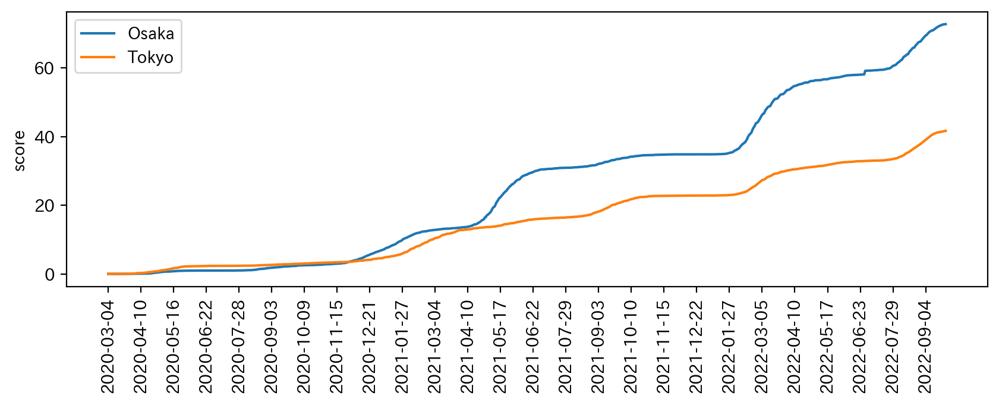
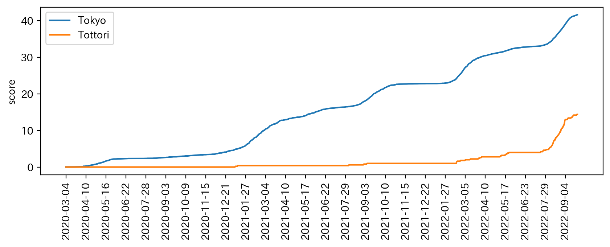
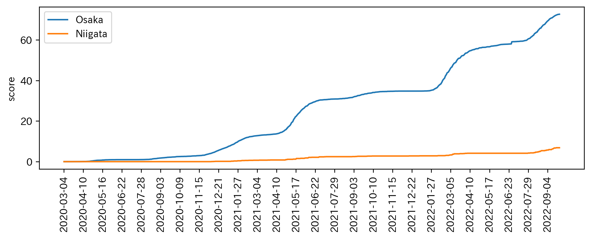
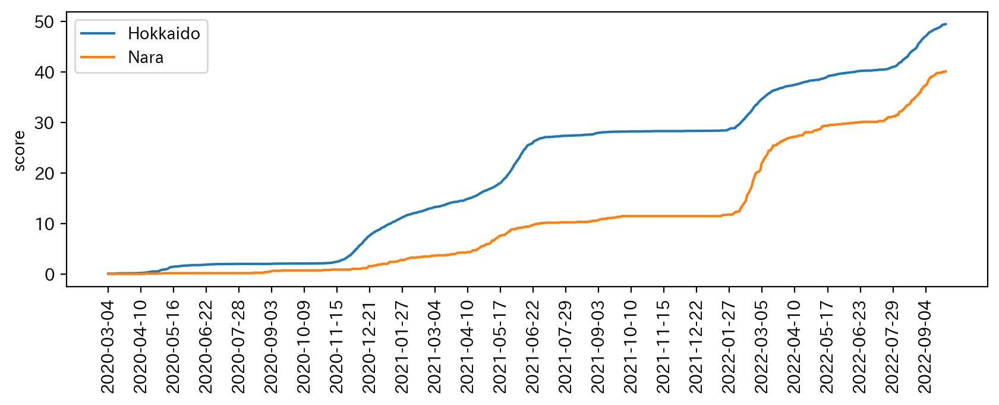

# jpcovid

jpcovidの目的は日本の都道府県ごとのcovid-19に対する政策の政策提案者の失敗を特定することです。

jpcovidはcovid-19による都道府県ごとの死者数の総計をその都道府県の人口で割ったスコアを時系列でグラフにしました

そのスコアのグラフは連続値で単調増加関数です。そのため、急激にグラフが増加しているところで政策提案者が間違いを犯していることとなります。

グラフの値が高いところほど、政策提案者はより深刻な間違いを犯していると考えることができます。

jpcovid は、インターネットを介して次のサイトから最新のデータをスクレイピングします。

以下のnhkのデータセットを利用していましたが、更新されなくなりました

https://www3.nhk.or.jp/n-data/opendata/coronavirus/nhk_news_covid19_prefectures_daily_data.csv

従って、以下の二つのデータセットを代わりに使用することができます
https://covid19.mhlw.go.jp/public/opendata/deaths_cumulative_daily.csv

or

https://covid19.mhlw.go.jp/public/opendata/number_of_deaths_daily.csv

# jpcovidのインストール方法
$pip install jpcovid

# jpcovidの実行方法
$ jpcovid <都道府県名>

$ jpcovid Tokyo Osaka

$ jpcovid Tokyo Tottori

$ jpcovid Osaka Niigata

$ jpcovid Hokkaido Nara

